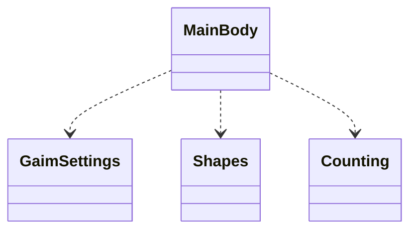

# Arkkitehtuurikuvaus

## Rakenne

Ohjelman rakenne on kolmitasoinen pakkausrakenne.

Mainbody sisältää pelisilmukan sekä lukee käyttäjän valitsemat toiminnot. Pakkaus Gaimsettings sisältää joitakin
yksittäisiä pelin asetuksia sekä hakee ja tallentaa käyttäjän tiedot. Pakkaus Shapes luo pelissä liikkuvat palikat 
sekä muokkaa palikoita uudelleen sitä mukaa kun rivejä poistetaan pelistä. Pakkaus Counting tekee palikoiden sijaintiin
liittyvää laskentaa. 

## MainBody

Pelisilmukka löytyy täältä. Silmukka lukee pelaajan syötteet ja valitsee toiminnan tämän perusteella

## GaimSettings

Täältä löytyy pelin pyörityksessä käytetyt asetukset kuten pelin nopeus. Täällä tapahtuu myös tietojen
pysyväistallennus sillä tallennettava informaatio on varsin pieni, jolloin omaa luokkaa ei sitä varten kannata rakentaa.

## Counting

Peliin liittyy erilaista laskentaa kuten palikoiden sijainti ja liikkeet, rivien poistaminen, pisteiden kertyminen
ja pelin päättyminen. Voi olla että kehityksen edetessä tätä osiota tulee vielä jakaa osiin.

## Shapes

Palikat arvotaan ja muodostetaan täällä.
