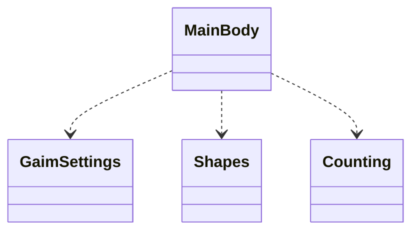

# Arkkitehtuurikuvaus

## Rakenne

Ohjelman rakenne on kolmitasoinen pakkausrakenne.

Mainbody sisältää pelisilmukan sekä lukee käyttäjän valitsemat toiminnot. Pakkaus Gaimsettings sisältää joitakin
yksittäisiä pelin asetuksia sekä hakee ja tallentaa käyttäjän tiedot. Pakkaus Shapes luo pelissä liikkuvat palikat 
sekä muokkaa palikoita uudelleen sitä mukaa kun rivejä poistetaan pelistä. Pakkaus Counting tekee palikoiden sijaintiin
liittyvää laskentaa.

## Käyttöliittymä

Käyttöliittymä sisältää kolme erilaista näkymää:
- Pelin aloitusnäkymä
- Pelinäkymä
- Pelin lopetus näkymä 

## Sovelluslogiikka

Peli on toteutettu Pygame-kirjastoa käyttäen.

## Tietojen pysyväistallennus ja Tiedostot

Gaimsettings luokka tallentaa pelaajan nimen ja pisteet CSV tiedostoon.

## Päätoiminnallisuudet

Seuraavassa kuvataan sovelluksen toimintalogiikkaa

### Pelin aloittaminen

Pelaaja syöttää oman nimensä. Mikäli pelaajan nimi löytyy tiedostosta, näyttää peli pelaajan saavuttamat korkeimmat
pisteet.

### Pelaaminen

Palikoita putoaa ruudun yläreunasta vauhdilla, joka kiihtyy pisteiden kertyessä. Pelaaja voi siirtää palikkaa oikealle
ja vasemmalle nuolinäppäimillä. Lisäksi pelaaja voi kääntää palikkaa nuolinäppäimillä. 

Pelin tarkoituksen on kerätä mahdollisimman paljon pisteitä. Pisteitä kertyy kun pelistä eliminoituu rivi. Tämä
saavutetaan kun koko rivi on täytetty palikoilla. 

Peli päättyy kun palikat yltävät ruudun yläreunaan.

## MainBody

Pelisilmukka löytyy täältä. Silmukka lukee pelaajan syötteet ja valitsee toiminnan tämän perusteella

## GaimSettings

Täältä löytyy pelin pyörityksessä käytetyt asetukset kuten pelin nopeus. Täällä tapahtuu myös tietojen
pysyväistallennus sillä tallennettava informaatio on varsin pieni, jolloin omaa luokkaa ei sitä varten kannata rakentaa.

## Counting

Peliin liittyy erilaista laskentaa kuten palikoiden sijainti ja liikkeet, rivien poistaminen, pisteiden kertyminen
ja pelin päättyminen. Voi olla että kehityksen edetessä tätä osiota tulee vielä jakaa osiin.

## Shapes

Palikat arvotaan ja muodostetaan täällä.
